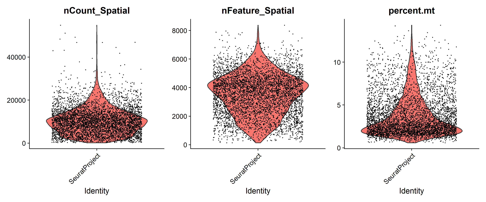
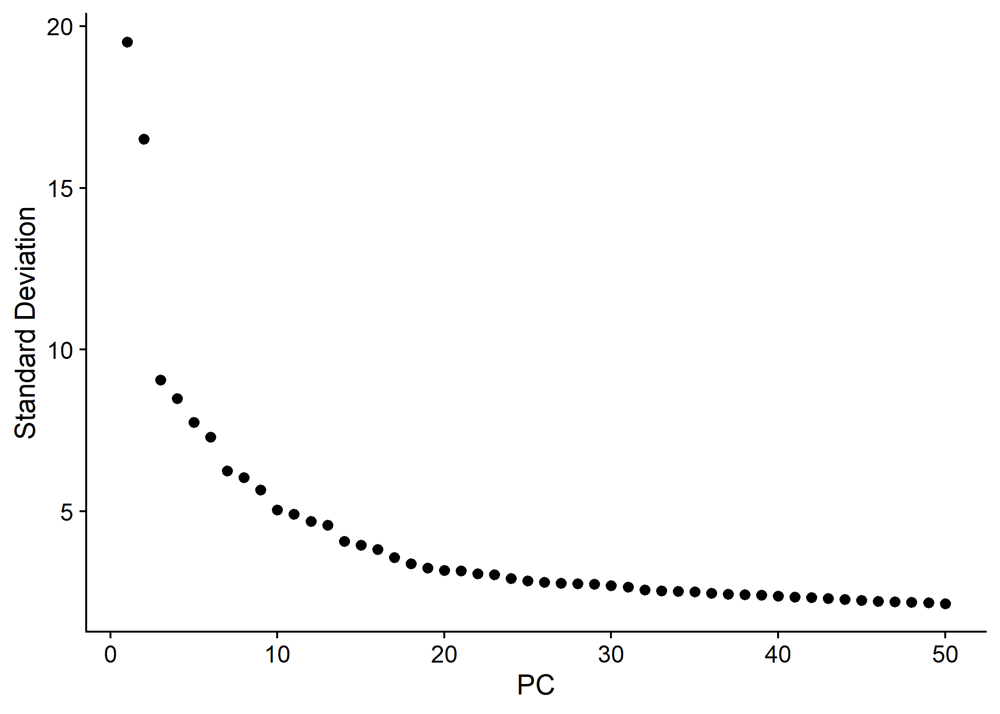
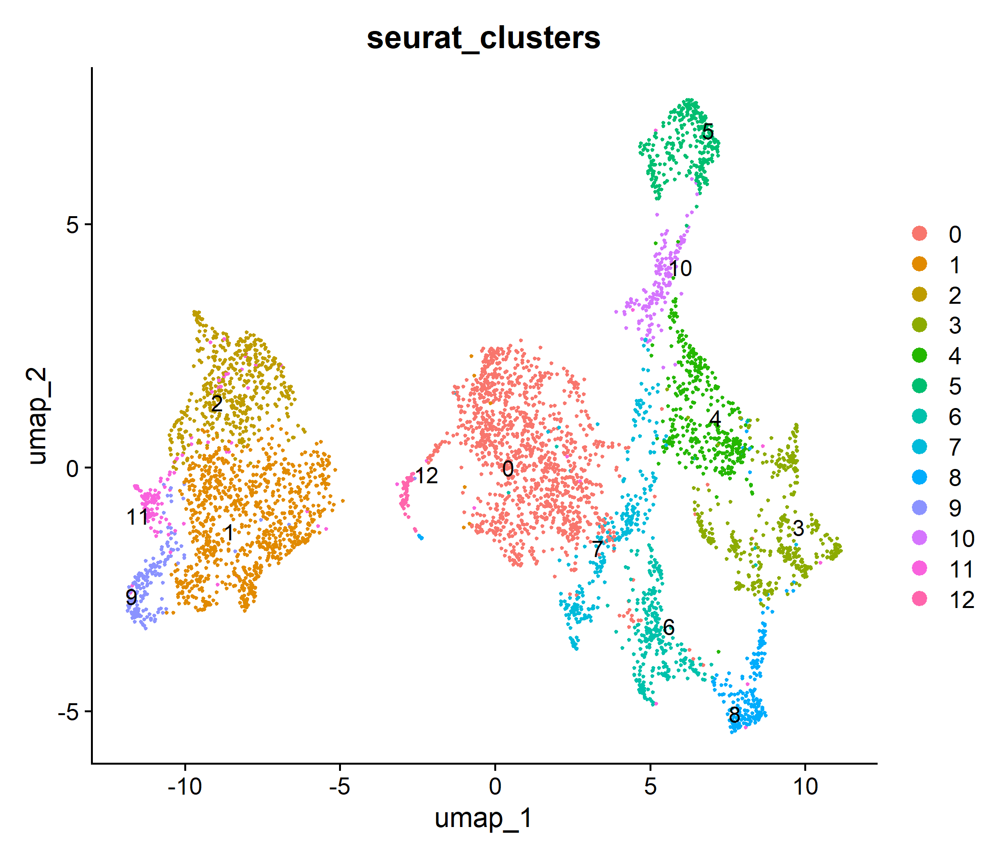
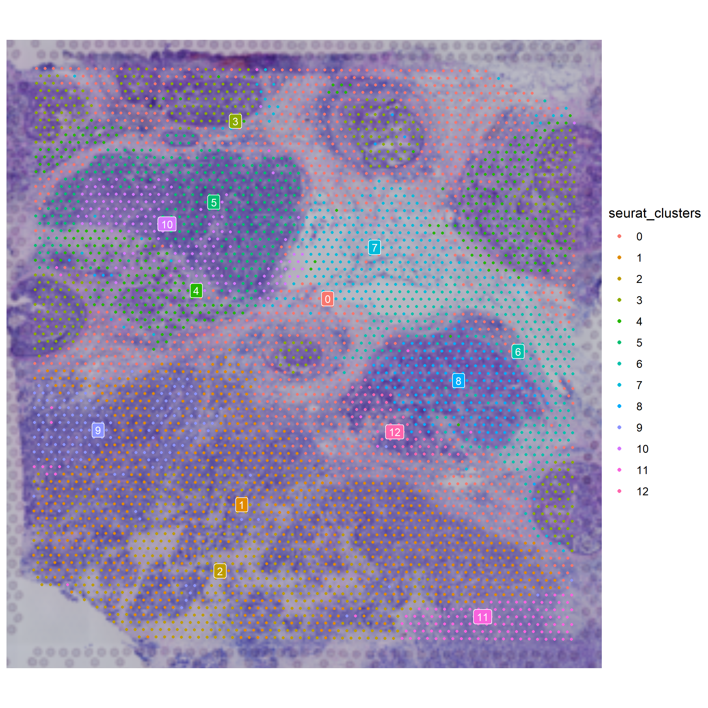
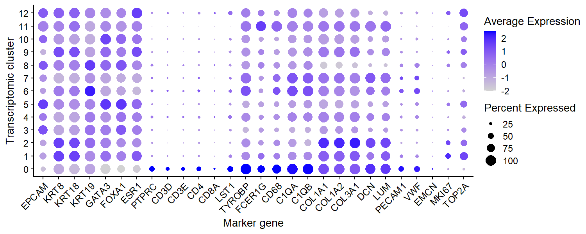
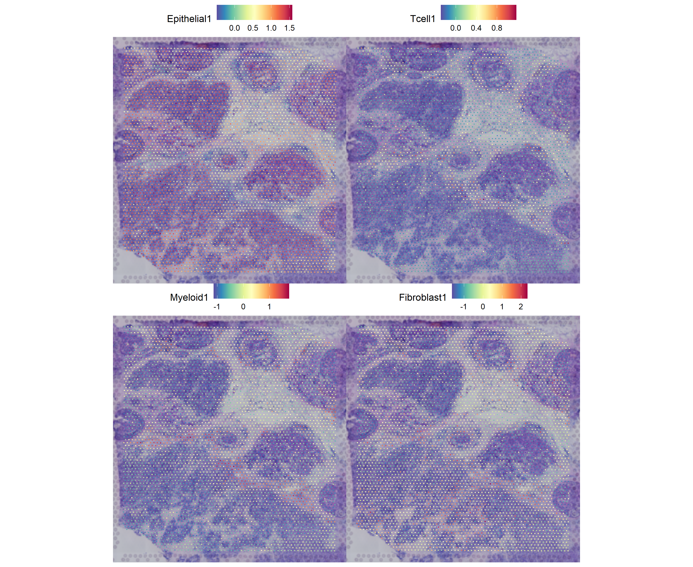
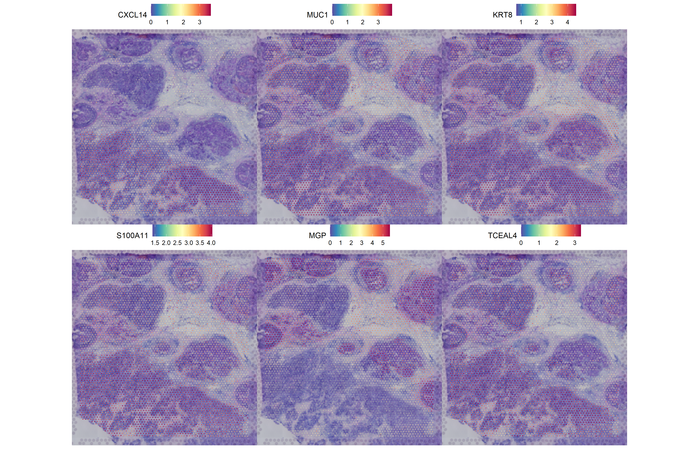
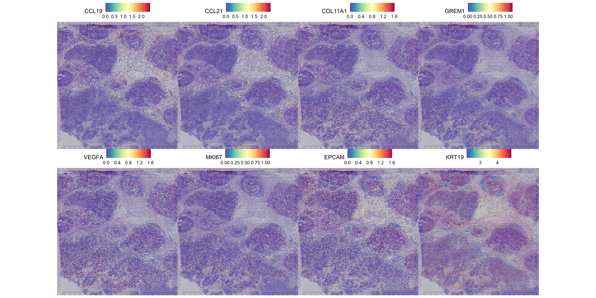

# Spatial Transcriptomic Analysis of Human Breast Cancer

Exploratory analysis of spatial transcriptional heterogeneity in a publicly available human breast cancer dataset using **10x Genomics Visium**, **R**, **Seurat**, tumour-microenvironment profiling and **Moran's I spatial autocorrelation**.

This project was developed as an independent computational cancer biology project to gain practical experience in spatial transcriptomics, R-based single-cell/spatial workflows and quantitative interpretation of the tumour microenvironment.

---

## Research question

**How are epithelial, immune and stromal transcriptional programmes spatially organised within a human breast cancer tissue section?**

The analysis investigates whether transcriptomically distinct regions correspond to coherent spatial niches within the tissue and explores genes exhibiting significant spatial organisation.

---

## Dataset

The project uses the publicly available **10x Genomics Visium Human Breast Cancer** dataset.

The analysed sample is a human breast cancer tissue section profiled using Visium spatial gene expression technology.

The dataset contains:

- **4,898 tissue-associated Visium spots**
- whole-transcriptome gene-expression measurements
- spatial coordinates for each spot
- an associated H&E histology image

Raw 10x data are not stored in this repository. Only analysis scripts, selected results and figures are included.

> **Important:** Visium spots are multicellular capture regions rather than individual cells. Biological annotations in this project therefore represent broad transcriptional programmes or enriched tissue regions rather than definitive single-cell identities.

---

## Analysis workflow

The workflow includes:

1. Visium data loading and spatial registration
2. Quality-control assessment
3. SCTransform normalisation
4. Principal component analysis
5. Graph-based clustering
6. UMAP dimensionality reduction
7. Mapping of transcriptomic clusters back onto tissue
8. Cluster marker identification
9. Tumour-microenvironment marker profiling
10. Epithelial, T-cell, myeloid and fibroblast programme scoring
11. Spatially variable gene analysis using Moran's I
12. Histopathological exploration in QuPath *(in progress)*

---

## 1. Quality control

Initial quality control assessed:

- transcript counts per Visium spot
- number of detected genes
- mitochondrial transcript percentage
- spatial distribution of library complexity

Spatial variation in transcript and feature counts showed coherent tissue-associated patterns rather than an obvious population of globally poor-quality spots. All tissue-associated spots were therefore retained for the initial exploratory analysis.

---

## 2. Dimensionality reduction and clustering

SCTransform-normalised expression profiles were analysed using PCA followed by graph-based clustering and UMAP.

The PCA elbow plot supported retention of the first **30 principal components** for the exploratory clustering analysis.

Graph-based clustering identified **13 transcriptomically distinct spatial clusters**.

Mapping these clusters back onto the H&E tissue demonstrated that many formed spatially coherent regions rather than being randomly distributed across the section.

---

## 3. Tumour-microenvironment profiling

Cluster interpretation was performed using marker genes associated with epithelial, immune, myeloid, stromal, vascular and proliferative programmes.

The analysis identified broad transcriptional regions consistent with:

- luminal/epithelial-associated programmes
- immune-enriched regions
- myeloid-associated regions
- extracellular-matrix and stromal programmes
- proliferative epithelial regions
- adipose/vascular-associated tissue regions

Because individual Visium spots can contain multiple cells, these annotations are interpreted as **regional transcriptional enrichment rather than pure cell-type classifications**.

---

## 4. Spatial tumour-microenvironment programmes

Gene-set module scores were calculated for broad tissue programmes including:

- epithelial
- T-cell
- myeloid
- fibroblast / extracellular-matrix

These programmes showed distinct and partially overlapping spatial distributions across the tissue section.

The results support substantial spatial heterogeneity within the breast cancer microenvironment, with epithelial, immune and stromal-associated signals occupying different tissue regions.

---

## 5. Spatially variable genes

To explicitly incorporate tissue location into the analysis, spatially variable genes were identified using **Moran's I spatial autocorrelation**.

The analysis was performed across 1,000 highly variable genes.

Among the strongest spatially organised genes were:

| Rank | Gene | Moran's I |
|---:|---|---:|
| 1 | CXCL14 | 0.613 |
| 2 | MUC1 | 0.612 |
| 3 | KRT8 | 0.600 |
| 4 | S100A11 | 0.580 |
| 5 | MGP | 0.555 |
| 6 | TCEAL4 | 0.531 |
| 7 | CCND1 | 0.528 |
| 8 | KRT18 | 0.525 |
| 9 | S100A16 | 0.523 |
| 10 | IFI27 | 0.519 |

Positive Moran's I values indicate that expression of these genes is spatially autocorrelated, with neighbouring tissue spots showing similar expression patterns.

The strongest spatial patterns were dominated by epithelial/luminal-associated genes, while additional spatial programmes were identified involving immune, stromal, hypoxia-associated and proliferative markers.

---

## 6. Hypothesis-driven spatial analysis

Genes identified from the cluster-marker analysis were also examined independently across the tissue.

Selected genes included:

`CCL19`, `CCL21`, `COL11A1`, `GREM1`, `VEGFA`, `MKI67`, `EPCAM` and `KRT19`.

These represent candidate immune-organisational, extracellular-matrix, hypoxia/angiogenesis, proliferation and epithelial programmes.

This analysis is hypothesis-generating and does not by itself establish specific histopathological structures or malignant cell identity.

---

## Key observations

The analysis indicates substantial spatial transcriptional heterogeneity within this breast cancer section.

Graph-based clustering identified spatially coherent tissue regions with differing epithelial, immune and stromal-associated expression profiles. Marker analysis suggested the presence of luminal epithelial programmes, immune-rich regions, proliferative epithelial regions, matrix-remodelling stromal niches and vascular/adipose-associated areas.

Independent Moran's I analysis further demonstrated that several genes exhibit strong spatial autocorrelation, supporting the presence of structured transcriptional programmes across the tissue.

These findings are exploratory and are intended to demonstrate a reproducible spatial-transcriptomics workflow rather than establish clinical or diagnostic conclusions.

---

## Digital pathology

A complementary **QuPath digital-pathology analysis** is currently being developed to compare spatial transcriptomic regions with morphological features visible on the corresponding H&E section.

Planned analyses include:

- tissue-region annotation
- comparison of cellular and stromal morphology
- examination of transcriptomically distinct spatial regions
- exploratory comparison between spatial gene-expression patterns and histological architecture

Digital pathology outputs will be added to the `pathology/` directory.

---
